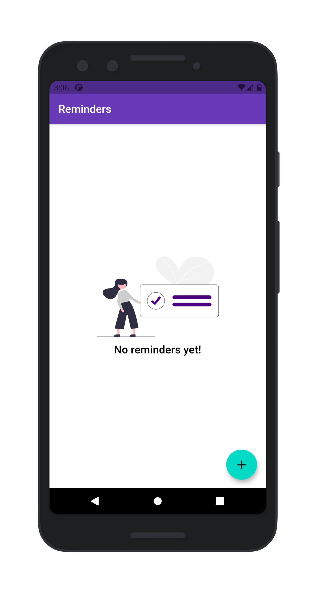
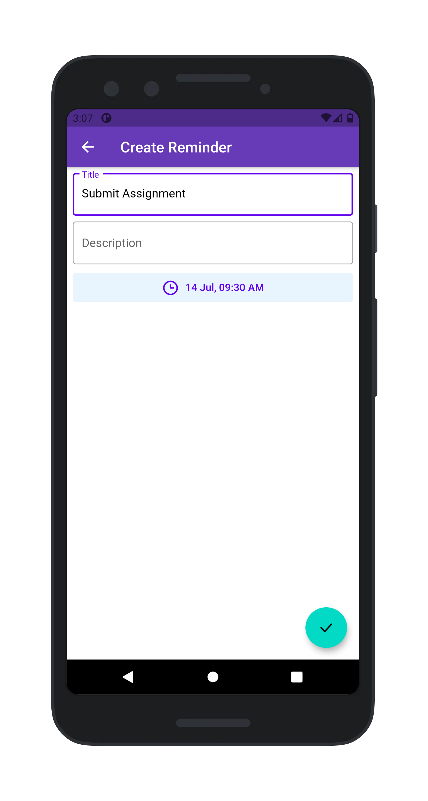
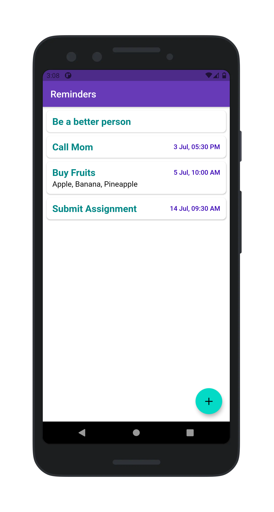
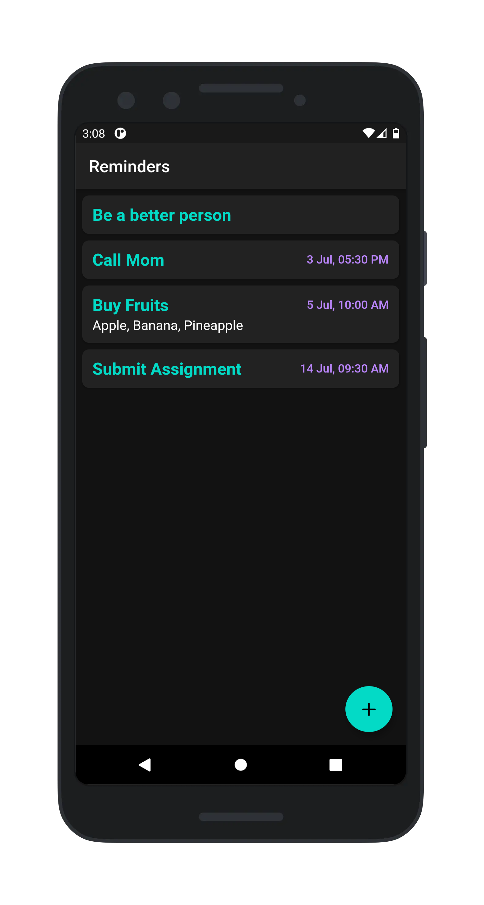

# SIMPLE REMINDER

 

 

Simple Reminder is an app that helps you to get things done. Simply choose a time for the reminder, enter a title and your note and we will take it from there!

## Screenshots

## Contributing

Found any bugs? Have any suggestions or code improvements? [Submit an issue](https://github.com/varadgauthankar/simple_reminder/issues) or fork and send a [pull request](https://github.com/varadgauthankar/simple_reminder/pulls) with your changes. All contributions are more than welcome.

## License

This project is licensed under the MIT License - see the [LICENSE](https://choosealicense.com/licenses/mit/) file for details.
